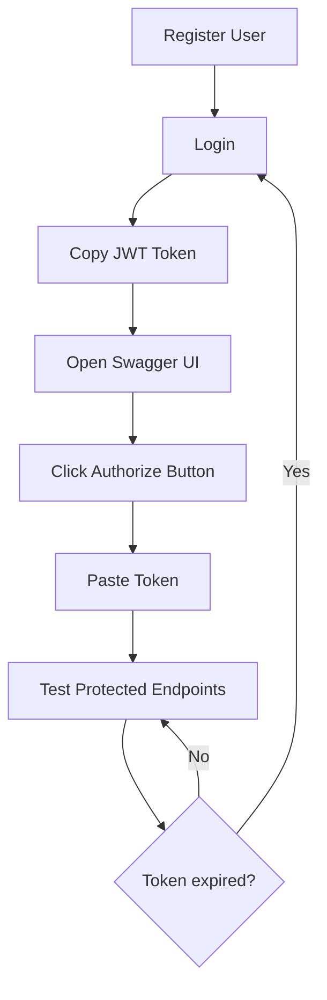

# 🔐 Hướng dẫn sử dụng Bearer Authentication trong Swagger UI

## 🎯 Vấn đề đã fix

**Trước đây:** Không thể paste JWT token vào Swagger UI vì thiếu Bearer Auth configuration.

**Bây giờ:** Tất cả services đều có nút **Authorize** (🔓) để nhập JWT token.

## 📝 Các bước sử dụng

### 1. Lấy JWT Token

Đăng nhập qua Auth Service để lấy token:

```bash
# Đăng ký user mới (nếu chưa có)
curl -X POST http://localhost:3003/auth/register \
  -H "Content-Type: application/json" \
  -d '{
    "username": "testuser",
    "email": "test@example.com",
    "password": "Test123456"
  }'

# Đăng nhập
curl -X POST http://localhost:3003/auth/login \
  -H "Content-Type: application/json" \
  -d '{
    "email": "test@example.com",
    "password": "Test123456"
  }'
```

**Response sẽ có:**
```json
{
  "access_token": "eyJhbGciOiJIUzI1NiIsInR5cCI6IkpXVCJ9.eyJzdWIiOi...",
  "user": { ... }
}
```

**Copy giá trị `access_token`** (không bao gồm dấu ngoặc kép)

### 2. Mở Swagger UI

Truy cập Swagger UI của service bạn muốn test:

- **Auth Service**: http://localhost:3003/api
- **Transaction Service**: http://localhost:3001/api
- **Account Service**: http://localhost:3002/api
- **API Gateway**: http://localhost:3000/api

### 3. Authorize trong Swagger

1. **Tìm nút "Authorize"** ở góc trên bên phải
   - Icon: 🔓 (ổ khóa mở)
   - Text: "Authorize"

2. **Click vào nút Authorize**
   - Popup sẽ hiện ra với field "JWT-auth"

3. **Paste JWT token**
   - Paste token vào field "Value"
   - **LƯU Ý**: Chỉ paste token, KHÔNG thêm "Bearer " prefix
   - Ví dụ: `eyJhbGciOiJIUzI1NiIsInR5cCI6IkpXVCJ9...`

4. **Click "Authorize"**
   - Nếu thành công, icon sẽ đổi thành 🔒 (khóa đóng)
   - Click "Close" để đóng popup

### 4. Test Protected Endpoints

Bây giờ bạn có thể test bất kỳ endpoint nào:

1. Click vào endpoint muốn test (ví dụ: `GET /transactions`)
2. Click "Try it out"
3. Điền parameters nếu cần
4. Click "Execute"
5. Xem response

**Token sẽ tự động được gửi** trong header `Authorization: Bearer <your_token>`

## 🔄 Workflow hoàn chỉnh



## ✅ Verification

Kiểm tra Bearer Auth đã được cấu hình:

```bash
./test-swagger-auth.sh
```

Expected output:
```
✅ All services (4/4) have Bearer Auth configured!
```

## 🎬 Demo Step-by-Step

### Example: Testing Transaction Service

1. **Get Token:**
```bash
TOKEN=$(curl -s -X POST http://localhost:3003/auth/login \
  -H "Content-Type: application/json" \
  -d '{"email":"test@example.com","password":"Test123456"}' | \
  python3 -c "import sys, json; print(json.load(sys.stdin)['access_token'])")

echo $TOKEN
```

2. **Open Browser:**
   - Go to http://localhost:3001/api

3. **Authorize:**
   - Click 🔓 "Authorize" button
   - Paste token (from `echo $TOKEN`)
   - Click "Authorize"
   - Click "Close"

4. **Test Endpoint:**
   - Expand `GET /transactions`
   - Click "Try it out"
   - Click "Execute"
   - See 200 OK response with data

## 🐛 Troubleshooting

### Vấn đề: Không thấy nút "Authorize"

**Nguyên nhân:** Service chưa có Bearer Auth configuration

**Giải pháp:**
1. Check file `apps/<service>/src/main.ts`
2. Đảm bảo có `.addBearerAuth()` trong DocumentBuilder:

```typescript
const config = new DocumentBuilder()
  .setTitle('Service API')
  .setDescription('Description')
  .setVersion('1.0')
  .addBearerAuth(
    {
      type: 'http',
      scheme: 'bearer',
      bearerFormat: 'JWT',
      name: 'JWT',
      description: 'Enter JWT token',
      in: 'header',
    },
    'JWT-auth', // ⚠️ Important: Reference name
  )
  .build();
```

3. Đảm bảo controller có `@ApiBearerAuth('JWT-auth')`:

```typescript
@ApiTags('transactions')
@ApiBearerAuth('JWT-auth') // ⚠️ Must match reference name
@Controller('transactions')
export class TransactionController { ... }
```

4. Rebuild và restart service:
```bash
docker compose build <service-name>
docker compose up -d <service-name>
```

### Vấn đề: Token bị reject với "Unauthorized"

**Nguyên nhân:**
1. Token expired (mặc định: 24h)
2. Token không hợp lệ
3. JWT_SECRET không khớp giữa services

**Giải pháp:**
1. Login lại để lấy token mới
2. Kiểm tra JWT_SECRET trong `.env` hoặc `docker-compose.yml`
3. Đảm bảo tất cả services dùng cùng JWT_SECRET

### Vấn đề: Response vẫn là 401 dù đã Authorize

**Nguyên nhân:** Token không được gửi đúng cách

**Kiểm tra:**
1. Token đã paste chính xác không có space thừa
2. Không thêm "Bearer " prefix khi paste
3. Icon đã đổi thành 🔒 (locked)

**Test bằng curl:**
```bash
curl -X GET http://localhost:3001/transactions \
  -H "Authorization: Bearer $TOKEN"
```

Nếu curl hoạt động nhưng Swagger không → Clear browser cache và reload.

## 📊 Services Status

Verify tất cả services:

| Service | Port | Swagger URL | Bearer Auth |
|---------|------|-------------|-------------|
| Auth | 3003 | http://localhost:3003/api | ✅ |
| Transaction | 3001 | http://localhost:3001/api | ✅ |
| Account | 3002 | http://localhost:3002/api | ✅ |
| API Gateway | 3000 | http://localhost:3000/api | ✅ |

## 🔒 Security Notes

### Token Best Practices

1. **Không share token:** Mỗi user nên có token riêng
2. **Token expiration:** Token hết hạn sau 24h (default)
3. **Refresh token:** Login lại khi token expired
4. **HTTPS trong production:** Luôn dùng HTTPS để bảo vệ token

### JWT Payload

Token chứa thông tin:
```json
{
  "sub": "user-id",
  "username": "testuser",
  "email": "test@example.com",
  "roles": ["user"],
  "iat": 1234567890,
  "exp": 1234654290
}
```

Không lưu thông tin nhạy cảm trong JWT payload!

## 📝 Technical Details

### Swagger Configuration

**Before:**
```typescript
const config = new DocumentBuilder()
  .setTitle('Transaction Service API')
  .setVersion('1.0')
  .build(); // ❌ No Bearer Auth
```

**After:**
```typescript
const config = new DocumentBuilder()
  .setTitle('Transaction Service API')
  .setVersion('1.0')
  .addBearerAuth(
    {
      type: 'http',
      scheme: 'bearer',
      bearerFormat: 'JWT',
      name: 'JWT',
      description: 'Enter JWT token',
      in: 'header',
    },
    'JWT-auth', // ✅ Reference name
  )
  .build();
```

### Controller Decoration

**Before:**
```typescript
@ApiBearerAuth() // ❌ No reference
@Controller('transactions')
export class Controller { ... }
```

**After:**
```typescript
@ApiBearerAuth('JWT-auth') // ✅ Must match reference name
@Controller('transactions')
export class Controller { ... }
```

### OpenAPI Spec

Generated Swagger JSON includes:

```json
{
  "components": {
    "securitySchemes": {
      "JWT-auth": {
        "type": "http",
        "scheme": "bearer",
        "bearerFormat": "JWT",
        "name": "JWT",
        "description": "Enter JWT token",
        "in": "header"
      }
    }
  },
  "security": [
    {
      "JWT-auth": []
    }
  ]
}
```

## 🎓 Resources

- [NestJS Swagger Documentation](https://docs.nestjs.com/openapi/security)
- [OpenAPI Bearer Auth Spec](https://swagger.io/docs/specification/authentication/bearer-authentication/)
- [JWT.io Debugger](https://jwt.io/) - Decode và verify JWT tokens

---

**Updated:** October 31, 2025  
**Author:** Finance App Team  
**Version:** 1.1.0
